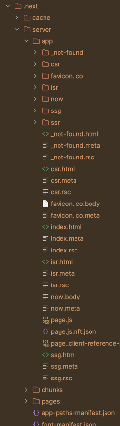

## 課題１

### SSR, CSR, SSG の違い

まず、この文脈におけるレンダリングは DOM ツリーを構築して画面を表示するブラウザの処理ではなく、フェッチしたデータと合わせて最初に表示する HTML を生成することを指すと考えられる。

このレンダリングされた HTML をブラウザが表示した後に、追加で非同期通信を用いたデータ取得が行われ画面が書き換わる可能性があるのはどのレンダリングパターンでも同じである。

### SSR = Server Side Rendering

SSR はリクエストを受け取ったサーバーがさらに外部サーバーやデータベースからデータを取得し、 HTML を生成する手法。

ブラウザから見ると最初からデータが入った状態の HTML が返ってくるので、 CSR と比較すると SEO に強くなる。
ただ、リクエストを送るたびにサーバーレンダリングを行う必要があるので、負荷が高くなる可能性がある。

Next.js や Nuxt を使って実装しなくても、 Laravel で Blade テンプレートを使って作ったサイトなんかは SSR といえる。

### CSR = Client Side Rendering

CSR は最初に空に近い HTML を返し、 JavaScript を用いてブラウザ側で取得したデータを DOM に追加する手法。

JavaScript を実行できないクローラーからは何が表示されるおページかわからないので SEO に弱くなる。
サーバーは最低限の HTML を返すだけでいいので負荷が低くなる。

また、レンダリングやデータ取得の速度がクライアントに依存するので、ユーザーの環境によっては表示が遅くなる可能性がある。

メリット・デメリットはいっぱいあるけど、

個人的に一番のメリットは書いたコードがブラウザでしか動かないので考えることが少なくて済むこと。    
個人的に一番のデメリットは初回アクセス時は絶対にローダーが回るのでちょっと不安定なサイトに見えちゃうこと。

### SSG = Static Site Generation

SSG はあらかじめデータが入った HTML を生成しておく手法。  
なのでデータの取得とレンダリングはビルド時のみ。

ビルド時に生成された HTML を CDN にキャッシュしておけば、リクエストを受け取ったサーバーが HTML を返すだけでいいので、負荷面においては最強。

ただ、データがリアルタイムに変わるようなサイトの場合は、結局 CSR と同じような感じになる。  
ブログとかコーポレートサイトに向いてる。  

### おまけ: ISR = Incremental Static Regeneration

ISR は SSG の一種で、ビルド時に生成された HTML を CDN にキャッシュしておきながら、リクエストを受け取ったサーバーがデータを取得して HTML を再生成する手法。

SSR のキャッシュとして SSG を使ってるとも考えられる。

今のところどんなサイトにも使えそうな手法だが、最初はキャッシュされたコンテンツが表示されるので整合性を求めるサイトには向かない。
あと、 Vercel + Next.js にベンダーロックインする？（似たようなことを SSR + stale-while-revalidate でもできるらしい）

## 課題２

App Router だといろいろ楽ちんだった。
ビルドに ssr.html が生成されていないことを確認。 

## 課題３

* 週1回更新されるブログ: SSG
* ユーザーのコメントが随時追加されるクックパッドのようなサービス: ISR
* freeeのような会計サービス: SSR
* 経営指標（OKRやKPIなど）を管理する社内サービス: CSR
* 社内SNS: ISR or CSR